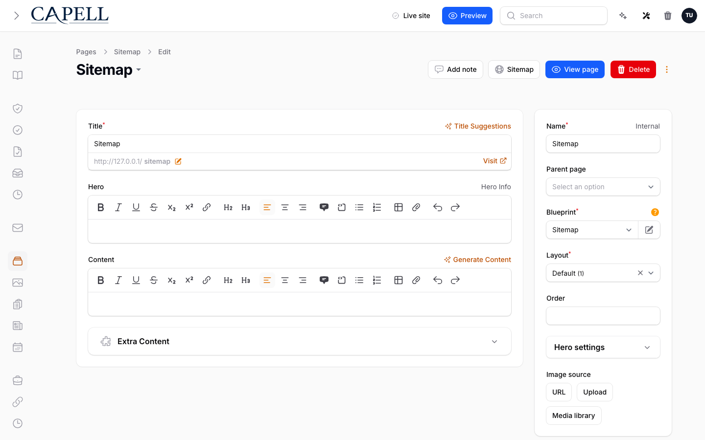
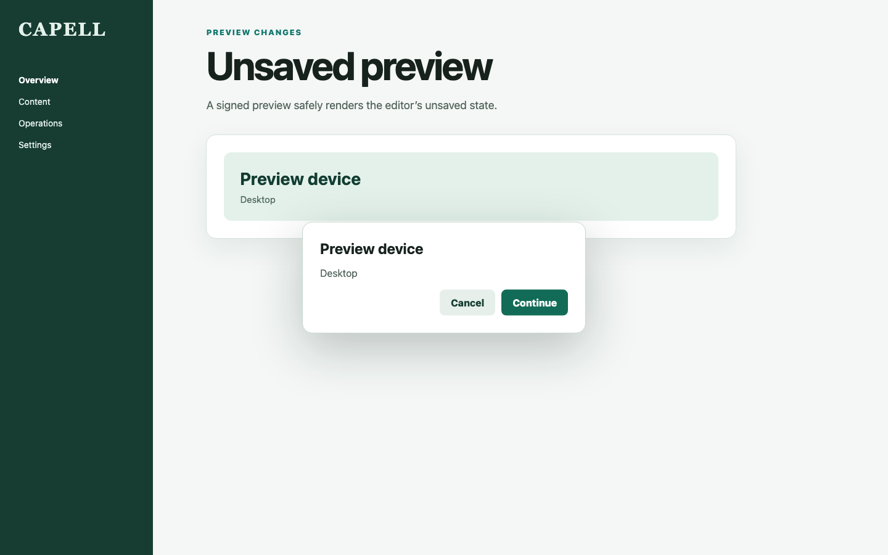

# Filament Peek

<!-- prettier-ignore-start -->

## What This Plugin Adds

Filament Peek is an **Available**, **No schema impact** Capell package in the **Capell Foundation** product group. It ships as `capell-app/filament-peek` and extends these surfaces: admin, frontend.

Filament Peek stores a private, per-user snapshot of unsaved page and Layout Builder state and renders it through an expiring signed preview route.

Editors open an unsaved preview from the page edit action and can check device presets before saving. Missing or expired snapshots return a private error rather than exposing preview state.

Evidence: [`capell.json`](capell.json), [`src/Actions/CreatePagePreviewSnapshotAction.php`](src/Actions/CreatePagePreviewSnapshotAction.php), [`src/Actions/RenderPagePreviewSnapshotAction.php`](src/Actions/RenderPagePreviewSnapshotAction.php), [`routes/web.php`](routes/web.php), [`docs/overview.admin.md`](docs/overview.admin.md), [`docs/screenshots.json`](docs/screenshots.json), [`src/Filament/Actions/PeekPagePreviewAction.php`](src/Filament/Actions/PeekPagePreviewAction.php), [`tests/Feature/PagePreviewRouteTest.php`](tests/Feature/PagePreviewRouteTest.php).

Status details:

- Status: Available
- Tier: free
- Bundle: foundation
- Composer package: `capell-app/filament-peek`
- Namespace: `Capell\FilamentPeek`
- Theme key: not applicable

## Why It Matters

**For developers:** Snapshot creation, lookup, state storage, and rendering are separate Actions behind typed data and a preview-state contract, with no database schema required.

**For teams:** Editors can review unsaved copy, media, and layout changes in the active theme before deciding whether to save or publish them.

Evidence: [`src/Data/PagePreviewSnapshotData.php`](src/Data/PagePreviewSnapshotData.php), [`src/Contracts/StoresLayoutBuilderPreviewState.php`](src/Contracts/StoresLayoutBuilderPreviewState.php), [`src/Actions/StoreLayoutBuilderPreviewStateAction.php`](src/Actions/StoreLayoutBuilderPreviewStateAction.php), [`tests/Unit/SnapshotActionTest.php`](tests/Unit/SnapshotActionTest.php), [`docs/screenshots.json`](docs/screenshots.json), [`tests/Feature/PeekPagePreviewActionTest.php`](tests/Feature/PeekPagePreviewActionTest.php), [`tests/Feature/PagePreviewRouteTest.php`](tests/Feature/PagePreviewRouteTest.php).

## Screens And Workflow

Screenshot contract: `docs/screenshots.json`.

- Page edit preview actions (admin, required).
- Signed unsaved preview modal (admin, optional).
- Filament Peek device preset controls (admin, optional).
- Expired preview friendly error page (frontend, optional).

## Technical Shape

- Service providers: `Capell\FilamentPeek\Providers\FilamentPeekServiceProvider`.
- Config files: `packages/filament-peek/config/capell-filament-peek.php`.
- Filament classes: `PeekPagePreviewAction`, `FilamentPeekPanelExtender`, `PagePeekPreviewActionExtender`.
- Route files: `packages/filament-peek/routes/web.php`.
- Extension contracts: `StoresLayoutBuilderPreviewState`.
- Actions: `CreatePagePreviewSnapshotAction`, `FindPagePreviewSnapshotAction`, `RegisterLayoutBuilderPreviewWidgetsAction`, `RenderPagePreviewSnapshotAction`, `StoreLayoutBuilderPreviewStateAction`.
- Data objects: `LayoutBuilderPreviewStateData`, `PagePreviewSnapshotData`.
- Manifest contributions: `route: Capell\FilamentPeek\Manifest\FilamentPeekRoutesContribution`.
- Health checks: `Capell\FilamentPeek\Health\FilamentPeekHealthCheck`.
- Blade views: `packages/filament-peek/resources/views/preview-error.blade.php`, `packages/filament-peek/resources/views/preview-ribbon.blade.php`.
- Cache tags: `filament-peek-preview`.

## Data Model

This package has no schema impact. It extends Capell through `route` contributions instead of declaring package-owned tables.

## Install Impact

- Required packages: `capell-app/admin`, `capell-app/frontend`.
- Admin navigation: no admin page or resource contribution is declared.
- Admin/editor extensions: none declared.
- Permissions: none declared in `capell.json`.
- Public routes: loads `routes/web.php`; registers `FilamentPeekRoutesContribution`.
- Database changes: no package migrations declared.
- Config: `config/capell-filament-peek.php`.
- Settings: no package settings declared.
- Queues or schedules: none declared.
- Cache tags: `filament-peek-preview`.
- Commands: none declared.

## Common Pitfalls

- Keep required Capell packages on compatible v4 releases: `capell-app/admin`, `capell-app/frontend`.
- Review package configuration before production-like verification: `config/capell-filament-peek.php`.
- Review middleware, throttling, signatures, and public-output safety in `routes/web.php` before exposing routes.
- Keep public Blade and cached HTML free of authoring markers, model IDs, permissions, signed editor URLs, and lazy database queries.
- Custom write integrations must preserve invalidation for `filament-peek-preview` cache tags.

## Troubleshooting

| Symptom | Likely cause | Check | Fix |
| --- | --- | --- | --- |
| Package surface is missing after install | Provider or manifest is not loaded | Confirm `capell.json`, package `composer.json`, and provider registration | Reinstall the package, refresh Composer autoload, and clear host caches |
| Route returns unexpected output | Route cache, middleware, or signed URL setup does not match the package route file | Check the route files listed in `Technical Shape` | Clear route cache and verify middleware before exposing public routes |
| Public output leaks unexpected state | Render data, cache variation, or authoring boundary has regressed | Check public Blade, cache tags, and public-output safety tests | Move data loading out of Blade and rerun the package public-output tests |

## Quick Start

1. Install the package: `composer require capell-app/filament-peek`.
2. Review `config/capell-filament-peek.php` before enabling the package.
3. Open the Page edit preview actions and confirm the admin workflow loads.

## Next Steps

- [Package docs](docs/README.md)
- [Overview](docs/overview.md)
- Configuration files: [`config/capell-filament-peek.php`](config/capell-filament-peek.php).
- [Troubleshooting](#troubleshooting)
- [Screenshot contract](docs/screenshots.json)
- [Marketplace assets](docs/assets/marketplace/)
- [Capell content language plan](../../docs/CONTENT_LANGUAGE_PLAN.md)
- [Capell documentation design system](../../docs/DESIGN_SYSTEM.md)
- [Capell and package ERD notes](../../docs/erd/capell-and-package-erds.md)
- Related packages: [Layout Builder](../layout-builder/README.md), [Publishing Studio](../publishing-studio/README.md).
- Focused tests: `vendor/bin/pest packages/filament-peek/tests --configuration=phpunit.xml`.

<!-- prettier-ignore-end -->
