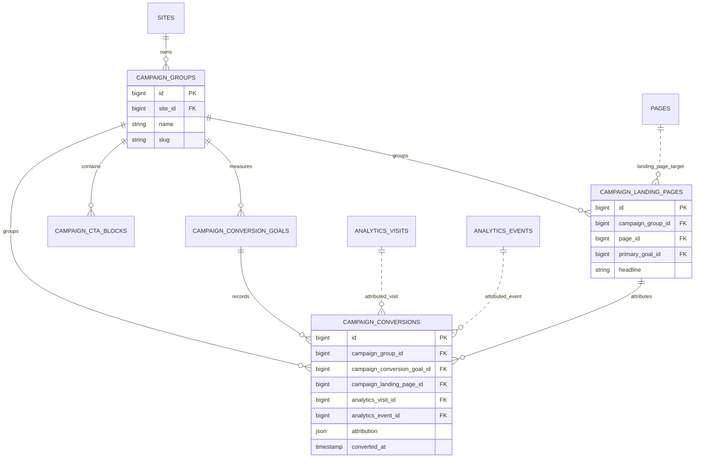

# Campaigns

Status: **Available, schema-owning** · Kind: **package** · Tier: **premium** · Bundle: **growth** · Contexts: **admin, frontend** · Product group: **Capell Growth**

This page is the consolidated implementation overview for the Campaigns package. It is extracted from the package README, service providers, migrations, config files, routes, resources, models, actions, and the shared Capell ERD notes where available.

## What This Plugin Adds

Campaigns adds campaign groups, landing pages, CTA blocks, conversion goals, UTM attribution, and conversion reporting to Capell.

- Campaign Filament resources for groups, landing pages, goals, and CTA blocks.
- Campaign dashboard widgets.
- Page schema extender for campaign fields.
- Mosaic widget configurators for campaign hero, CTA, and lead form blocks.
- Conversion recording actions for page views, CTA clicks, and form submissions.

## Developer Notes

Connects Capell pages, Forms, Analytics, and Mosaic through explicit actions and listener classes instead of inline resource logic.

- CampaignsServiceProvider, AdminServiceProvider, and FrontendServiceProvider register package surfaces.
- Config file: capell-campaigns.php.
- Migrations create campaign groups, goals, landing pages, CTA blocks, and conversions.
- Filament resources cover each owned model.
- Listeners sync landing pages and form submission conversions.

## Operational Notes

Lets marketing and editorial teams connect landing pages to goals and see which campaigns convert.

- Adds campaign admin navigation and database tables.
- Adds campaign dashboard widgets.
- Adds config keys for conversion cookie, UTM keys, table names, and layout presets.
- May use Analytics events and Forms submissions when those packages are installed.
- No explicit public route is registered by this package.

## Data And Retention

- campaign_groups belong to sites.
- campaign_landing_pages belong to groups and target pages.
- campaign_conversion_goals define measurable outcomes.
- campaign_cta_blocks store CTA content.
- campaign_conversions connect goals, landing pages, analytics visits/events, and attribution JSON.

## Screenshot Plan

- Campaign groups index.
- Campaign landing pages index.
- Campaign conversion goals form.
- CTA block form.
- Campaign dashboard widgets.
- Frontend landing page with campaign widgets.

## Pitfalls

- Install dependent packages before expecting attribution from forms or analytics.
- Check UTM keys before launch.
- Create conversion goals before reporting on landing page success.

## Verification

- Run `vendor/bin/pest packages/campaigns/tests` when package tests exist.
- Run the relevant host-app migration or package install flow in a disposable database.
- Open the listed admin or frontend surface and compare it with the screenshot plan.

## Package Manifest

- Composer name: `capell-app/campaigns`
- Product group: Capell Growth
- Kind: package
- Tier: premium
- Bundle: growth
- Contexts: `admin`, `frontend`
- Requires: `capell-app/core`, `capell-app/admin`, `capell-app/frontend`, `capell-app/mosaic`, `capell-app/forms`
- Optional dependencies: `capell-app/analytics`, `capell-app/seo-tools`

## Admin Surfaces

- CampaignConversionGoalResource (packages/campaigns/src/Filament/Resources/CampaignConversionGoals/CampaignConversionGoalResource.php)
- CreateCampaignConversionGoal (packages/campaigns/src/Filament/Resources/CampaignConversionGoals/Pages/CreateCampaignConversionGoal.php)
- EditCampaignConversionGoal (packages/campaigns/src/Filament/Resources/CampaignConversionGoals/Pages/EditCampaignConversionGoal.php)
- ListCampaignConversionGoals (packages/campaigns/src/Filament/Resources/CampaignConversionGoals/Pages/ListCampaignConversionGoals.php)
- CampaignCtaBlockResource (packages/campaigns/src/Filament/Resources/CampaignCtaBlocks/CampaignCtaBlockResource.php)
- CreateCampaignCtaBlock (packages/campaigns/src/Filament/Resources/CampaignCtaBlocks/Pages/CreateCampaignCtaBlock.php)
- EditCampaignCtaBlock (packages/campaigns/src/Filament/Resources/CampaignCtaBlocks/Pages/EditCampaignCtaBlock.php)
- ListCampaignCtaBlocks (packages/campaigns/src/Filament/Resources/CampaignCtaBlocks/Pages/ListCampaignCtaBlocks.php)
- CampaignGroupResource (packages/campaigns/src/Filament/Resources/CampaignGroups/CampaignGroupResource.php)
- CreateCampaignGroup (packages/campaigns/src/Filament/Resources/CampaignGroups/Pages/CreateCampaignGroup.php)
- EditCampaignGroup (packages/campaigns/src/Filament/Resources/CampaignGroups/Pages/EditCampaignGroup.php)
- ListCampaignGroups (packages/campaigns/src/Filament/Resources/CampaignGroups/Pages/ListCampaignGroups.php)
- CampaignLandingPageResource (packages/campaigns/src/Filament/Resources/CampaignLandingPages/CampaignLandingPageResource.php)
- CreateCampaignLandingPage (packages/campaigns/src/Filament/Resources/CampaignLandingPages/Pages/CreateCampaignLandingPage.php)
- EditCampaignLandingPage (packages/campaigns/src/Filament/Resources/CampaignLandingPages/Pages/EditCampaignLandingPage.php)
- ListCampaignLandingPages (packages/campaigns/src/Filament/Resources/CampaignLandingPages/Pages/ListCampaignLandingPages.php)

## Commands

- `capell:campaigns-install-layouts {--force : Update existing campaign layouts}` (packages/campaigns/src/Console/Commands/InstallCampaignLayoutsCommand.php)

## Routes And Config

- Config: packages/campaigns/config/capell-campaigns.php

## Permissions And Gates

- Gate: CampaignOverviewStatsWidget: `admin`, `super_admin`
- Gate: TopCampaignsWidget: `admin`, `super_admin`
- Gate: TopLandingPagesWidget: `admin`, `super_admin`

## Migrations

- Migration: 2026_04_20_000001_create_campaign_groups_table.php
- Migration: 2026_04_20_000002_create_campaign_conversion_goals_table.php
- Migration: 2026_04_20_000003_create_campaign_landing_pages_table.php
- Migration: 2026_04_20_000004_create_campaign_cta_blocks_table.php
- Migration: 2026_04_20_000005_create_campaign_conversions_table.php

## ERD Excerpt

## Screenshot Automation

Deployment should read [screenshots.json](screenshots.json), install the package with demo data, resolve each admin surface or frontend URL, and write images to `public/docs/screenshots/packages/campaigns`.

- Campaign groups index.
- Campaign landing pages index.
- Campaign conversion goals form.
- CTA block form.
- Campaign dashboard widgets.
- Frontend landing page with campaign widgets.
