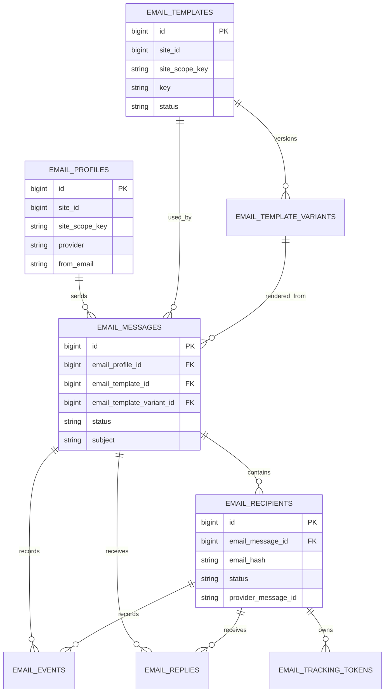

# Email Studio Database

Email Studio owns its own schema. The tables are designed for auditability first: the package stores the template, rendered content, recipients, provider result, and suppression state needed to explain a send later.

## Tables

| Table                          | Purpose                                                                                                 |
| ------------------------------ | ------------------------------------------------------------------------------------------------------- |
| `email_profiles`               | Sender identity, reply-to settings, provider type, tracking defaults, and provider settings.            |
| `email_templates`              | Template identity, status, declared variables, name, and description.                                   |
| `email_template_variants`      | Sendable template content by site scope, locale, profile, status, and version.                          |
| `email_messages`               | One send request, including rendered subject/body snapshots and trigger context.                        |
| `email_recipients`             | Per-recipient lifecycle state, provider message IDs, failure reasons, and event timestamps.             |
| `email_events`                 | Provider lifecycle events such as delivered, bounced, complained, opened, clicked, replied, and failed. |
| `email_replies`                | Inbound reply records linked to messages and recipients.                                                |
| `email_suppressions`           | Active or released suppressions by normalized email hash and site scope.                                |
| `email_template_registrations` | Package-owned template definitions and variable contracts.                                              |
| `email_tracking_tokens`        | Opaque public tokens for open and click tracking.                                                       |

## Scope Columns

Privacy-sensitive and site-owned records store:

- `site_id`, nullable for global records;
- `site_scope_key`, always set to a value such as `global` or `site:12`.

Use `site_scope_key` for uniqueness and lookup logic. Do not rely on nullable `site_id` to distinguish global records.

## Template Versioning

`email_templates` stores the stable key and declared variables. `email_template_variants` stores the subject, preview text, HTML body, plain text body, locale, status, and version.

Only approved templates and active variants should be used for production sends. Retired variants stay available for audit history because old messages reference the variant used at send time.

## Message Snapshots

`email_messages` stores rendered subject, preview text, HTML, plain text, headers, and context snapshot.

This is intentional duplication. If an editor changes a template tomorrow, yesterday's sent message still needs to show what was rendered yesterday.

Retention tooling will later redact rendered bodies and context snapshots after the configured window while preserving delivery metadata.

## Recipient State

`email_recipients` stores one row per recipient. The current send pipeline writes:

- `queued` when the recipient can be sent;
- `suppressed` when an active suppression blocks delivery;
- `sent` when the provider accepts the send;
- `failed` when provider delivery fails.

Future webhook slices will move recipients into delivered, bounced, complained, opened, clicked, and replied states.

## Suppressions

Suppressions store the original email, normalized email, and a SHA-256 hash of the normalized email.

The unique key is:

```text
site_scope_key + email_hash + reason + source
```

That lets Email Studio keep separate provider, complaint, bounce, unsubscribe, and manual suppressions without creating duplicate active rows for the same source.

Released suppressions keep their history by setting `released_at`. Suppression checks ignore released rows.

## Provider Events And Replies

The event and reply tables are present before the webhook slice so the package can grow without changing its core message model.

Expected follow-up behaviour:

- provider webhooks normalize into `ProviderWebhookEventData`;
- events are idempotent by provider/idempotency key;
- bounce and complaint events can create suppressions;
- inbound replies link to recipients by provider message ID or normalized sender data;
- reply state updates the recipient and message timeline.

## Tracking Tokens

Tracking tokens must remain opaque. Public open and click routes should resolve by token only and return generic responses for invalid or expired tokens.

Do not expose message IDs, recipient IDs, template keys, package names, or admin state in public tracking URLs.

## ERD


