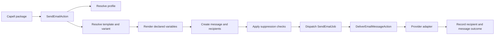

# Email Studio Overview

Email Studio is the transactional email layer for Capell. It gives first-party and project packages one path for template registration, site-aware rendering, provider delivery, send recording, suppressions, and later provider events.

The product goal is simple: when an email matters, Capell should be able to show what was supposed to be sent, who it was sent to, which provider handled it, and why it failed when it failed.

## Responsibilities

Email Studio owns:

- template definitions and template variants;
- delivery profiles and provider selection;
- send requests, rendered snapshots, and recipient rows;
- suppression checks before queueing and before delivery;
- provider adapter contracts;
- future webhook events, reply capture, open/click tracking, and retention cleanup.

Email Studio does not own:

- newsletter subscribers;
- audience imports;
- segment rules;
- bulk campaign orchestration;
- public authoring controls.

Those boundaries keep the package useful for transactional email without turning it into a newsletter platform.

## Visible Surfaces

Email Studio currently has no package-owned Filament resource, page, widget, public route, or public Blade screen to capture. `AdminServiceProvider` and `FrontendServiceProvider` reserve those integration surfaces for later slices, while `routes/web.php` is intentionally empty in the current package.

The active runtime surface is service-level:

- package actions for registering templates, rendering variants, suppressing recipients, sending messages, and delivering queued mail;
- `SendEmailJob`;
- provider adapter contracts and registries;
- database records for templates, profiles, messages, recipients, events, replies, suppressions, registrations, and tracking tokens.

## Screenshot Coverage

The screenshot contract is stored in [screenshots.json](screenshots.json). It intentionally contains no required entries until an admin or frontend UI ships.

## Workflow

The send pipeline stores a rendered snapshot before delivery. That is intentional. Support staff need to see what was generated at send time even if the template changes later.

## Site Scope

Most records store both `site_id` and `site_scope_key`. The `site_scope_key` avoids nullable uniqueness traps and makes global records explicit.

Common values:

- `global` for shared templates, profiles, and suppressions;
- `site:12` for records owned by a specific site.

Actions receive the scope instead of asking models to infer it. That keeps writes predictable and easier to test.

## Rendering Rules

Templates use simple `{{ variable }}` placeholders. Variables must be declared on the `EmailTemplate` before they are rendered in production mode.

- Subject, preview text, and HTML output are escaped.
- Plain text output is not HTML-escaped.
- Preview mode leaves missing placeholders visible.
- Production rendering throws when a placeholder is missing or undeclared.

This is deliberately smaller than Blade. Email templates should be safe, reviewable, and easy to diagnose.

## Delivery Outcomes

Messages can be requested, queued, sent, failed, or partially failed. Recipients can be queued, sent, failed, suppressed, delivered, bounced, complained, opened, clicked, or replied.

The current implementation records queue/send/failure/suppression states. Provider lifecycle events, replies, opens, and clicks are planned follow-up slices using the models already present in the schema.

## Sellable Product Layer

The sellable part of Email Studio is not the transport. Laravel already sends email well. The paid value is the command centre around that transport:

- reusable templates across packages;
- approval-ready variants per site and locale;
- delivery profiles for real client brands;
- recipient-level audit trails;
- suppressions and complaint handling;
- a reply inbox;
- retention and redaction tooling;
- provider diagnostics that make support cases cheaper.

That makes Email Studio a good fit for a premium Capell Communications bundle.
