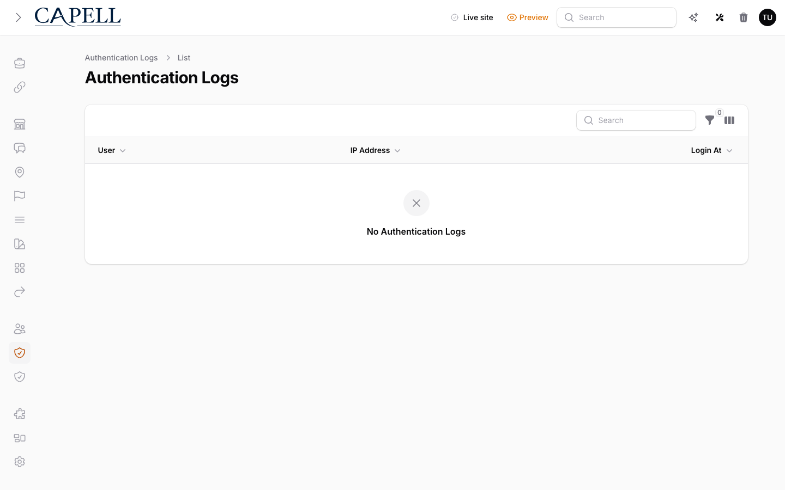
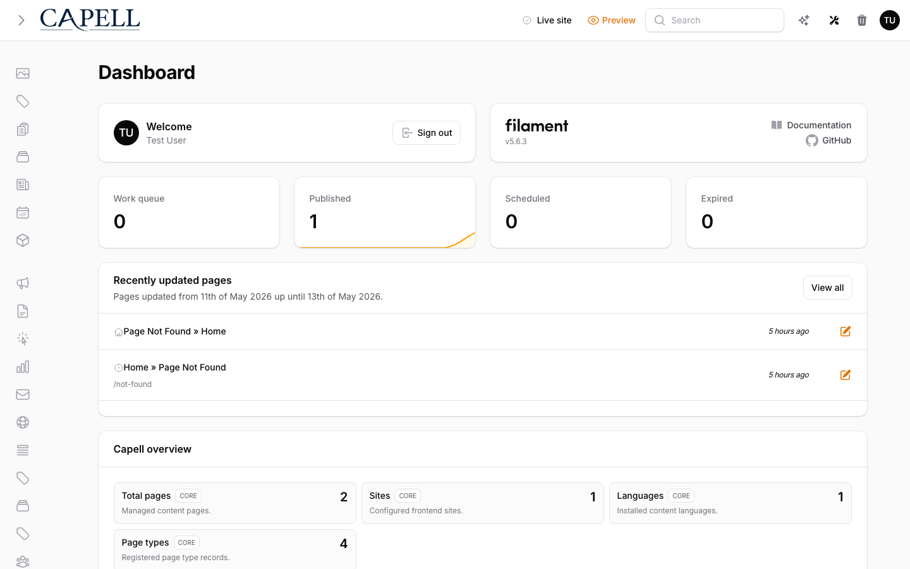
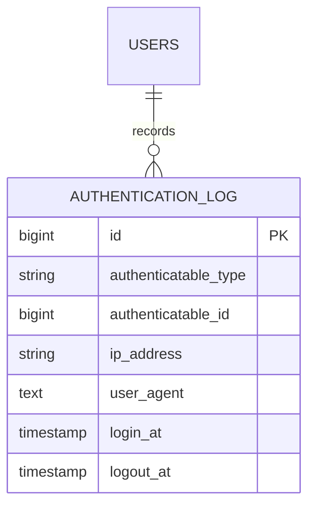

# Login Audit

Status: **Available, schema-owning** · Kind: **package** · Tier: **premium** · Bundle: **operations** · Contexts: **admin** · Product group: **Capell Operations**

This page is the implementation overview for the Login Audit package. It is based on the package README, providers, migrations, config, Filament resources, Actions, middleware, and tests.

## What This Plugin Adds

Login Audit records login, failed login, logout, and last-activity metadata for Capell users.

- Filament resource for authentication logs.
- Dashboard widget for recent authentication activity.
- Settings schema for authentication log behaviour.
- Middleware for admin and user activity tracking.
- User edit sidebar summary and authentication logs relation manager when the bridge is enabled.

## Developer Notes

The package uses `rappasoft/laravel-authentication-log` for event capture and storage, then layers Capell-specific settings, Actions, resources, widgets, bridge fields, and IP retention policy on top.

- `LoginAuditServiceProvider` registers config, translations, migrations, settings, protected table metadata, the `frontend.activity` middleware alias, and the `LoginAudit` model override.
- `AdminServiceProvider` registers the admin bridge, Filament resource, dashboard widget, settings contributor, persistent admin middleware, and monthly `login-audit:purge` schedule.
- `LoginAuditResource` extends `Tapp\FilamentAuthenticationLog\Resources\AuthenticationLogResource` and replaces the table with `LoginAuditsTable`.
- `AdminActivityMiddleware` and `UserActivityMiddleware` update matching audit rows without changing unrelated vendor audit state.

## Operational Notes

Helps site operators review access activity and spot account behaviour that needs follow-up.

- Adds login_audit table.
- Adds settings migration.
- Adds authentication log admin resource and widget.
- Listens to Laravel auth events configured in login-audit.php.
- May send new-device or failed-login notifications depending on config.

## Data And Retention

- login_audit stores authenticatable type/id, IP address, user agent, login time, and logout time.
- Records belong polymorphically to authenticatable users.
- Config purge value defaults to 365 days.

## Screenshot Plan

- Authentication logs admin index.
- Authentication log table filters.
- Dashboard widget.
- Authentication log settings screen.

## Screenshots







## Pitfalls

- Set CDN IP header config before trusting IP addresses behind a proxy.
- Confirm notification settings before production rollout.
- Run migrations before loading the resource.
- In Laravel 13 apps, use the `fdemb/laravel-authentication-log` PR fork at the root app level until upstream ships Laravel 13 support.

## Verification

- Run `vendor/bin/pest packages/login-audit/tests --configuration=phpunit.xml`.
- Run the relevant host-app migration or package install flow in a disposable database.
- Open the listed admin or frontend surface and compare it with the screenshot plan.

## Package Manifest

- Composer name: `capell-app/login-audit`
- Product group: Capell Operations
- Kind: package
- Tier: premium
- Bundle: operations
- Contexts: `admin`
- Requires: `capell-app/admin`
- Optional dependencies: None listed.

## Laravel 13 Dependency Note

`rappasoft/laravel-authentication-log` PR #140 adds Laravel 13 support. Until that PR is released upstream, Laravel 13 host apps need the fork as a root Composer repository and alias:

```json
{
    "repositories": [
        {
            "type": "vcs",
            "url": "https://github.com/fdemb/laravel-authentication-log"
        }
    ],
    "require": {
        "rappasoft/laravel-authentication-log": "dev-main as 6.0.1"
    }
}
```

Keep `packages/login-audit/composer.json` on the normal `^6.0|^5.0` constraint. Composer inline aliases are root-only, so the fork alias belongs in the consuming Laravel app, not inside the package dependency list.

## Admin Surfaces

- LoginAuditResource (packages/login-audit/src/Filament/Resources/LoginAudits/LoginAuditResource.php)
- LoginAuditsWidget (packages/login-audit/src/Filament/Widgets/LoginAuditsWidget.php)
- LoginAuditSettingsSchema (packages/login-audit/src/Filament/Settings/LoginAuditSettingsSchema.php)
- LoginAuditsRelationManager (packages/login-audit/src/Filament/Resources/Users/RelationManagers/LoginAuditsRelationManager.php)

## Commands

- None proven in this package directory.

## Routes And Config

- Config: packages/login-audit/config/login-audit.php

## Permissions And Gates

- Gate: LoginAuditsWidget: `admin`, `super_admin`

## Migrations

- Migration: create_login_audit_table.php
- Settings migration: add_login_audit_settings.php

## ERD Excerpt



## Screenshot Automation

Deployment should read [screenshots.json](screenshots.json), install the package with demo data, resolve each admin surface or frontend URL, and write images to `public/docs/screenshots/packages/login-audit`.

- Authentication logs admin index: seeded audit records for the demo admin user.
- Authentication log table filters: filter drawer and date/success controls.
- Dashboard/widget configuration: Access Logs contribution available in dashboard settings.
- Authentication log settings screen: retention, IP tracking, visibility, and user bridge settings.
- User edit access summary: recent login, failed attempt, device, and active-session counts.
- User authentication logs relation use case: requires the host user model to expose `authentications()`, normally through Rappasoft's `AuthenticationLoggable` trait.
