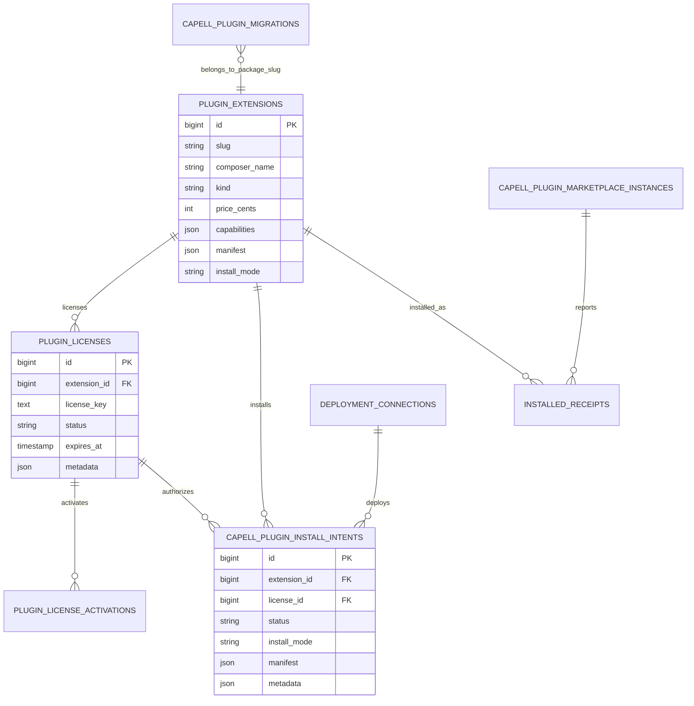

# Plugins

Status: **Pipeline, no Composer manifest in this directory**

This page is the consolidated implementation overview for the Plugins package directory. It is extracted from the config file and the shared Capell package ERD notes.

## What This Plugin Adds

Plugins is currently a config-only package directory for Capell marketplace and install intent settings.

- Configures the marketplace feature flag.
- Configures Anystack API and Composer repository endpoints.
- Configures license heartbeat cache and offline grace behaviour.
- Configures Composer binary and timeout values for install operations.

## Developer Notes

This directory does not currently provide runtime code. Treat it as configuration for a marketplace surface that must be backed by another package or future implementation.

- Config file: capell-plugins.php.
- No service provider is present.
- No migrations, models, routes, Filament resources, actions, jobs, or tests are present.
- Shared ERD references plugin extensions, licenses, install intents, marketplace instances, installed receipts, deployment connections, and plugin migrations.

## Operational Notes

The config is not enough to enable package install workflows safely by itself.

- Keep CAPELL_PLUGINS_ENABLED false until backing migrations and admin surfaces are confirmed.
- Verify Anystack and Composer repository credentials before enabling install intent.
- Confirm license heartbeat expectations for offline sites.

## Data And Retention

- This directory has no schema impact.

## Screenshot Plan

- Marketplace package index.
- Package detail page.
- Install intent screen.
- License verification state.
- Install result state.

## Pitfalls

- Do not describe planned marketplace behaviour as shipped from this directory.
- Do not enable the feature flag without confirmed backing code.
- Do not assume Anystack credentials are present in local or production environments.

## Verification

- Confirm the host app has the runtime package that consumes capell-plugins.php.
- Confirm marketplace migrations exist before enabling install intent.
- Confirm the admin surface is hidden while CAPELL_PLUGINS_ENABLED is false.

## Package Manifest

- Composer name: No Composer manifest is present.
- Product group: Not declared.
- Kind: Not declared.
- Tier: Not declared.
- Bundle: Not declared.
- Contexts: Not declared.
- Requires: Not declared.
- Optional dependencies: None listed.

## Admin Surfaces

- None proven in this package directory.

## Commands

- None proven in this package directory.

## Routes And Config

- Config: packages/plugins/config/capell-plugins.php

## Permissions And Gates

- None proven in this package directory.

## Migrations

- None proven in this package directory.

## ERD Excerpt

## Screenshot Automation

Deployment should read [screenshots.json](screenshots.json), install the package with demo data, resolve each admin surface or frontend URL, and write images to `public/docs/screenshots/packages/plugins`.

- Package marketplace index.
- Package detail or install intent screen.
- License verification state.
- Install progress or result state.
