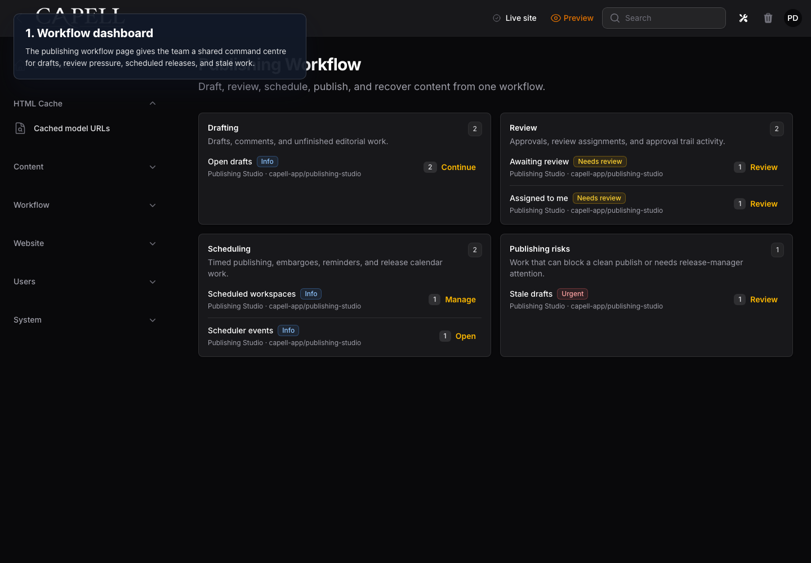
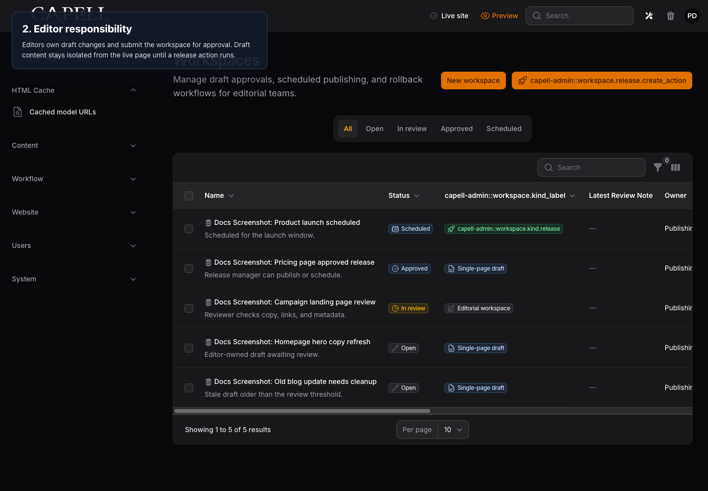
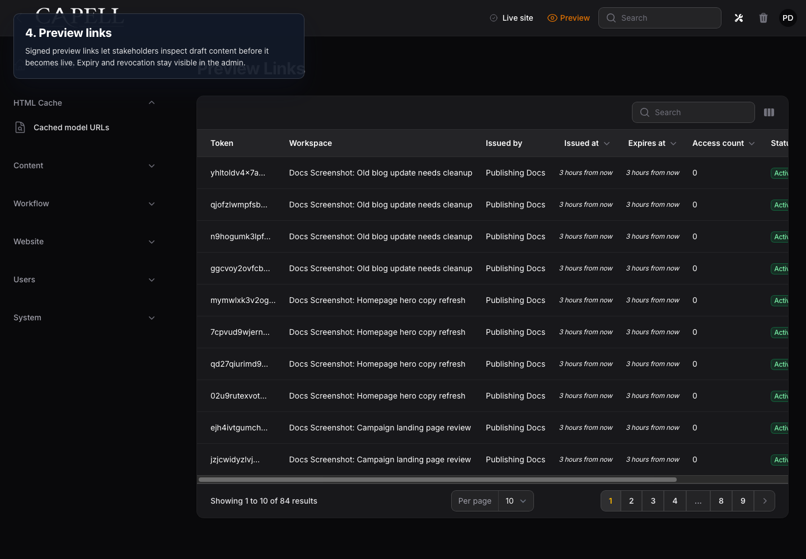
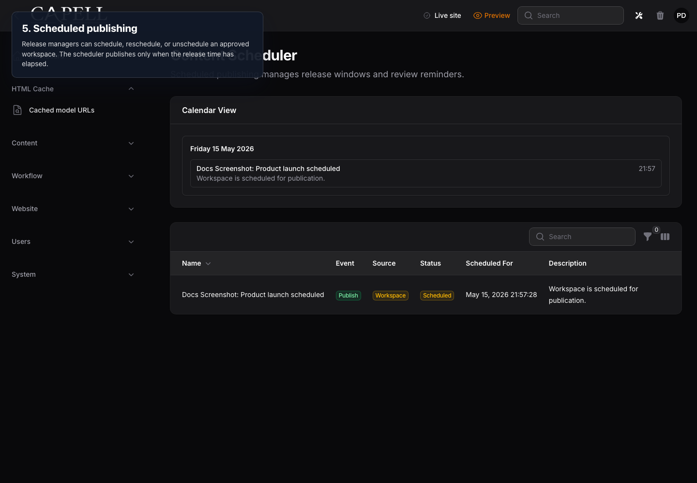
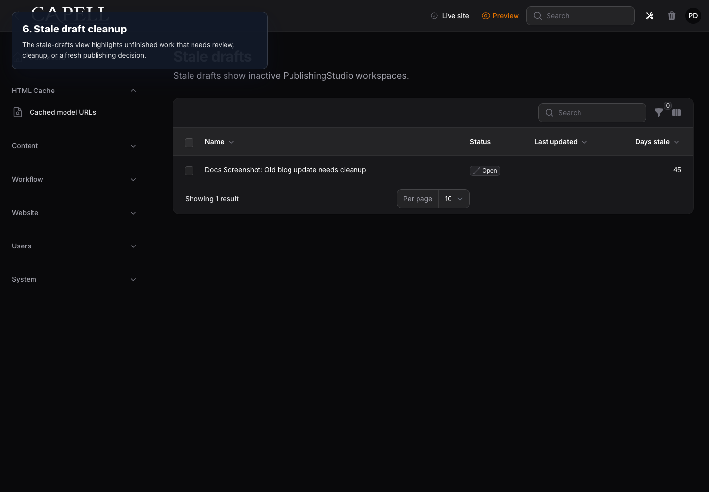

# PublishingStudio Publishing Workflow

This focused guide extends [Overview](overview.md) for the PublishingStudio package.

## Purpose

PublishingStudio controls Capell's editorial timeline for Draftable records: preview, compare, comment, assign reviewers, approve, validate, schedule, publish, restore, and rollback. It is the premium workflow layer for teams that want content history, readiness checks, and safe publishing without editing live records directly.

Release Workspaces are the campaign-shaped form of the same workflow: editors group coordinated changes, preview the workspace, compare it with live, collect approvals, schedule the release, and publish the workspace atomically.

## Workflow

1. Create a draft workspace or page draft.
2. Preview the draft through signed preview links, managed preview-link records, or the frontend preview banner.
3. Compare the draft against the live version and resolve field comments.
4. Assign reviewers, request review, and collect submit, approve, reject, or request-changes decisions.
5. Run dry-run validation and readiness checks for accessibility, links, alt text, SEO meta, stale workspace state, URL collisions, and release-window rules.
6. Publish immediately, schedule the release, set unpublish dates, add embargo windows, add review reminders, or request changes.
7. Watch stale drafts and activity history so unresolved work stays visible.
8. Use version history, entity restore, rollback, and rollback reporting when a published version needs to move back.

## Included Package Surfaces

- WorkspaceResource for draft publishing-studio, status, compare, approve, schedule, validate, preview, publish, and rollback actions.
- CompareVersionPage for field/media/URL/layout diff, comments, dry-run validation, and readiness context.
- PreviewLinkResource for preview link expiry, revocation, access counts, and issued-by context.
- ScheduledPublishingPage for scheduled releases, embargoes, unpublish dates, and review reminders.
- StaleDraftsPage for old draft cleanup and review nudges.
- ActivityTrailPage and widgets for audit-friendly workflow history.
- PageVersionHistoryPage for revisions, published versions, rollback lineage, and restore context.
- ImportPagesPage for recovery-center page import validation, relation resolution, execution, and rollback reporting.

## Gates

- `submit_workspace`
- `approve_workspace`
- `publish_workspace`
- `rollback_workspace`
- `publish_outside_release_window`

## Draftable Contract

- Draft/publish models must implement the Capell Draftable contract.
- Models must be registered for workspace copy-on-write behaviour.
- Package integrations should use PublishingStudio actions instead of writing live rows directly.

## Annotated Workflow Screenshots

These screenshots were captured from a local Capell admin panel with overlay
text that names the responsibility at each stage. They are intended for package
docs and marketplace review, not as a substitute for the automated workflow
tests.

### 1. Workflow Dashboard

The publishing workflow page is the shared command centre for open drafts,
review pressure, scheduled releases, and stale work.

### 2. Editor Responsibility

Editors own draft changes and submit the workspace for approval. Draft content
stays isolated from the live page until a release action runs.

### 3. Reviewer Responsibility

Reviewers approve, reject, or request changes. Approval unlocks release controls
but does not publish content by itself.

### 4. Preview Links

Signed preview links let stakeholders inspect draft content before it becomes
live. Expiry and revocation stay visible in the admin.

### 5. Scheduled Publishing

Release managers can schedule, reschedule, or unschedule an approved workspace.
The scheduler publishes only when the release time has elapsed.

### 6. Stale Draft Cleanup

The stale-drafts view highlights unfinished work that needs review, cleanup, or
a fresh publishing decision.

