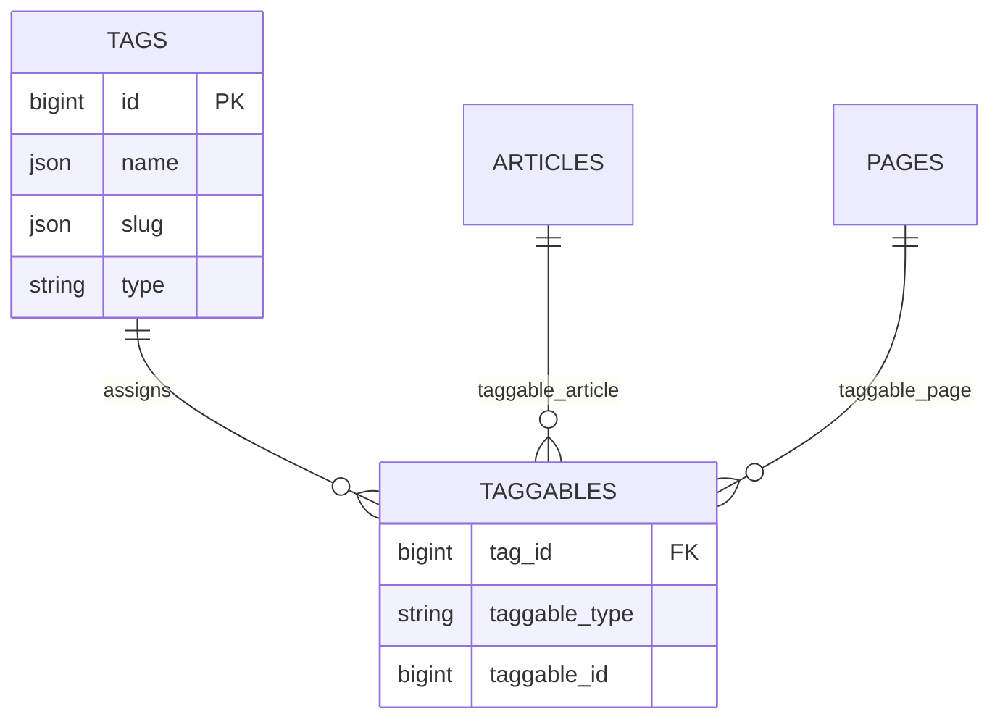

# Tags

Status: **Available, schema-owning** · Kind: **package** · Tier: **free** · Bundle: **foundation** · Contexts: **admin, console** · Product group: **Capell Foundation**

This page is the consolidated implementation overview for the Tags package. It is extracted from the package README, service providers, migrations, config files, routes, resources, models, actions, and the shared Capell ERD notes where available.

## What This Plugin Adds

Tags adds tag management, taggable relationships, a reusable tags input, and model traits for Capell content.

- Tag Filament resource.
- TagsInput form component.
- HasTags model concern.
- Tag and Taggable models.
- Install command and model registrar.

## Developer Notes

Provides a shared tagging layer that Blog and page-like models can use without each package defining its own tag tables.

- TagsServiceProvider, AdminServiceProvider, and ConsoleServiceProvider register package surfaces.
- Migration alters/creates tag-related table support.
- Models: Tag and Taggable.
- Filament resource: TagResource.
- TagTypeEnum defines tag types.

## Operational Notes

Lets editors classify content consistently across articles and pages.

- Adds tag database changes.
- Adds tag admin navigation.
- Adds tags form component.
- No public route is registered by this package.

## Data And Retention

- tags stores translated name and slug values plus type.
- taggables connects tags to articles, pages, and other taggable models.
- Tag model registrar handles morph/model integration.
- Deletion behaviour for taggables should be verified before removing shared tags.

## Screenshot Plan

- Tags admin index.
- Create/edit tag form.
- Tag relation manager showing tagged pages.
- Article or page form using TagsInput.

## Pitfalls

- Run the install command or migration before using TagsInput.
- Register taggable models before expecting relationships.
- Use typed tag categories rather than ad hoc strings.

## Verification

- Run `vendor/bin/pest packages/tags/tests` when package tests exist.
- Run the relevant host-app migration or package install flow in a disposable database.
- Open the listed admin or frontend surface and compare it with the screenshot plan.

## Package Manifest

- Composer name: `capell-app/tags`
- Product group: Capell Foundation
- Kind: package
- Tier: free
- Bundle: foundation
- Contexts: `admin`, `console`
- Requires: `capell-app/admin`
- Optional dependencies: None listed.

## Admin Surfaces

- CreateTag (packages/tags/src/Filament/Resources/Tags/Pages/CreateTag.php)
- EditTag (packages/tags/src/Filament/Resources/Tags/Pages/EditTag.php)
- ListTags (packages/tags/src/Filament/Resources/Tags/Pages/ListTags.php)
- TagResource (packages/tags/src/Filament/Resources/Tags/TagResource.php)

## Commands

- `capell:tags-install` (packages/tags/src/Console/Commands/InstallCommand.php)

## Routes And Config

- None proven in this package directory.

## Permissions And Gates

- None proven in this package directory.

## Migrations

- Migration: 2026_05_10_190872_01_alter_tags_table.php

## ERD Excerpt

## Screenshot Automation

Deployment should read [screenshots.json](screenshots.json), install the package with demo data, resolve each admin surface or frontend URL, and write images to `public/docs/screenshots/packages/tags`.

- Tags admin index.
- Create/edit tag form.
- Tag relation manager showing tagged pages.
- Article or page form using TagsInput.
